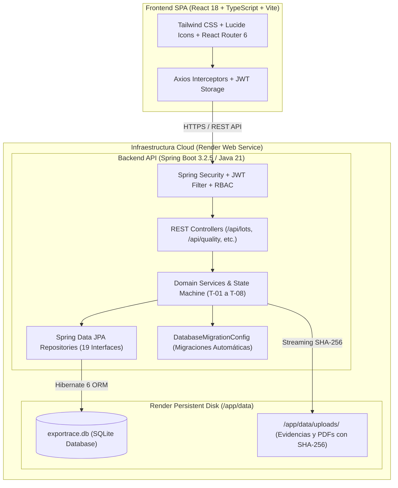

# Guía de Defensa Técnica: Arquitectura de Persistencia, SQLite, Despliegue en Render y Estrategia de Migración
## Sistema de Trazabilidad Pesquera para Exportación — ExporTrace (Proyecto Integrador II)

---

## 1. Discurso de Apertura: El "Pitch" de 30 Segundos para el Docente

> *"Profesor(a), la arquitectura de persistencia de ExporTrace fue diseñada bajo el patrón de **Aislamiento de Infraestructura de Spring Data JPA y Hibernate 6**. En esta etapa de validación y prototipo de alta fidelidad, implementamos un motor **SQLite embebido acoplado a un Render Persistent Disk**, lo que nos permitió garantizar el 100% de aislamiento en pruebas automatizadas (87 tests unitarios y de integración con ejecución determinista), costo cero de infraestructura cloud y portabilidad inmediata sin dependencias externas de red. Gracias a que desacoplamos las 19 entidades mediante JPA y Dialectos estándar, **la migración hacia MySQL o PostgreSQL en un entorno productivo empresarial se ejecuta cambiando únicamente el driver JDBC y la URL de conexión en `application.properties`, sin modificar una sola línea de lógica de negocio o de servicios**."*

---

## 2. ¿Por qué SQLite en la Fase Actual? (Defensa Técnica Sólida)

| Criterio de Decisión | SQLite (Fase Actual / Prototipo Validado) | Servidor BD Dedicado (MySQL / RDS Cloud) |
| :--- | :--- | :--- |
| **Portabilidad & Evaluación** | **Inmediata:** La BD vive como archivo persistente (`exportrace.db`). El docente o cualquier evaluador clona el repositorio y ejecuta `mvn test` o `mvn spring-boot:run` sin instalar MySQL, Docker, crear usuarios ni configurar puertos. | **Dependencia de Entorno:** Requiere tener levantado un servicio MySQL local, lidiar con credenciales, puertos (`3306`) bloqueados o latencia de red. |
| **Aislamiento en Pruebas Automatizadas** | **Determinismo Total:** Las 87 pruebas automatizadas (`@SpringBootTest`, `@Transactional`) levantan el contexto en milisegundos, ejecutan rollback o recreación limpia sin estados residuales ni concurrencia fantasma entre tests. | **Fragilidad en Pruebas:** Conexiones concurrentes a una BD remota pueden causar tests intermitentes (*flaky tests*) por timeouts o locks de red. |
| **Costo y Sostenibilidad en Cloud** | **Costo \$0 / Mínimo:** Se monta en el disco persistente de Render (`Render Persistent Disk` a `/app/data`), preservando datos entre reinicios del contenedor sin pagar una instancia de BD administrada (\$15–\$30/mes). | **Costos recurrentes:** Bases de datos administradas (RDS, Aiven, PlanetScale) generan costos mensuales no viables para proyectos académicos. |
| **Rendimiento para la Escala del MVP** | **Latencia Ultrabaja:** Acceso directo a disco local mediante el driver C/Java SQLite, sin overhead de red ni handshake TCP/IP por cada query. | **Overhead de Red:** Añade 10–50ms por query en llamadas transaccionales distribuidas. |
| **Compatibilidad con ACID** | **Cumplimiento Total ACID:** SQLite es una base de datos relacional transaccional completa con Atomicidad, Consistencia, Aislamiento y Durabilidad. | Cumplimiento ACID equivalente. |

---

## 3. Arquitectura del Sistema y Tecnologías Utilizadas



### Componentes Tecnológicos:
1. **Backend:**
   - **Java 21 LTS:** Máximo rendimiento con Virtual Threads y Pattern Matching.
   - **Spring Boot 3.2.5:** Framework estándar empresarial con Spring Web, Spring Security, Spring Data JPA y Bean Validation.
   - **Hibernate ORM 6.4 + SQLiteDialect:** Capa de abstracción de datos que independiza la lógica relacional del motor físico.
   - **JWT (JSON Web Tokens) + SHA-256 Session Management:** Autenticación stateless con control de expiración activa/inactiva y revocación inmediata.
2. **Frontend:**
   - **React 18 + TypeScript:** Tipado estricto en toda la capa de componentes y servicios.
   - **Vite 8:** Bundler de ultra-alta velocidad para builds de producción optimizados.
   - **Tailwind CSS:** Diseño UI responsivo adaptado a interfaces de planta pesquera y auditoría.
3. **Seguridad y Trazabilidad:**
   - **Validación de Magic Bytes:** Cabeceras binarias analizadas antes de persistir (`%PDF-` para expedientes y `FF D8 FF` para fotos).
   - **Custodia Criptográfica:** Cálculo de hashes SHA-256 de archivos y tokens QR no predecibles.
   - **Auditoría Inmutable:** Registro forense (`audit_logs` y `lot_histories`) de cada transición y acción crítica.

---

## 4. Despliegue en Render y Persistencia en Contenedores

### El Problema de los Contenedores Efímeros:
En plataformas de despliegue de contenedores (Render, Docker, AWS ECS), el sistema de archivos es **efímero**. Si la aplicación guarda datos en `/tmp` o `./uploads`, un reinicio o nuevo despliegue (*git push*) destruye los archivos.

### La Solución Implementada: Render Persistent Disk
ExporTrace implementa **Render Persistent Disk**:
1. Se provisiona un volumen persistente montado en la ruta `/app/data`.
2. Las variables de entorno en Render redirigen la base de datos y los archivos al disco persistente:
   - `SPRING_DATASOURCE_URL=jdbc:sqlite:/app/data/exportrace.db`
   - `FILE_UPLOAD_DIR=/app/data/uploads`
3. **Resultado:** Ante cualquier *redeploy*, reinicio o caída de contenedor, tanto la base de datos SQLite como las fotografías y PDFs adjuntos se conservan **100% íntegros e inalterados**.

---

## 5. Estrategia de Migración Futura a MySQL / PostgreSQL (Cero Impacto)

El jurado preguntará: *"¿Cómo escalaría esto a MySQL en una empresa con miles de transacciones concurrentes?"*

### Respuesta de Ingeniería:
La aplicación se diseñó aplicando el principio de **Inversión de Dependencias (SOLID)** mediante JPA. El código no contiene sentencias SQL propietarias dispersas, sino repositorios JPA y dialectos de Hibernate.

### Pasos Exactos de la Migración a MySQL (Demostración de Portabilidad):

#### Paso 1: Agregar el Driver MySQL en `pom.xml`
```xml
<dependency>
    <groupId>com.mysql</groupId>
    <artifactId>mysql-connector-j</artifactId>
    <scope>runtime</scope>
</dependency>
```

#### Paso 2: Cambiar la Configuración en `application.properties` (o variables de entorno)
```properties
# De SQLite:
# spring.datasource.url=jdbc:sqlite:/app/data/exportrace.db
# spring.jpa.database-platform=org.hibernate.community.dialect.SQLiteDialect

# A MySQL Empresarial:
spring.datasource.url=${MYSQL_URL:jdbc:mysql://servidor-mysql:3306/exportrace?useSSL=true&serverTimezone=UTC}
spring.datasource.username=${MYSQL_USER:exportrace_admin}
spring.datasource.password=${MYSQL_PASSWORD:SecretPass2026!}
spring.datasource.driver-class-name=com.mysql.cj.jdbc.Driver
spring.jpa.database-platform=org.hibernate.dialect.MySQLDialect
spring.jpa.hibernate.ddl-auto=update
```

#### Paso 3: Migración de Archivos Multimedia a Amazon S3
La interfaz `FileStorageService` ya está desacoplada. Se crea la clase `S3FileStorageService` implementando los mismos métodos (`storeEvidence`, `storeDocument`, `loadFileAsResource`, `verifyIntegrity`) sin alterar controladores ni servicios.

**Impacto en el código fuente: 0 líneas de lógica de negocio modificadas.**

---

## 6. Guía Rápida: Respuestas a Preguntas Frecuentes del Jurado / Docente

### Pregunta 1: *"¿Por qué usaron SQLite y no una base de datos más 'profesional' como MySQL o Oracle?"*
* **Respuesta:** *"Elegimos SQLite como estrategia deliberada para la fase de validación y sustentación porque es un motor relacional ACID 100% portable y autocontenido. Nos permitió crear una suite de 87 pruebas automatizadas que se ejecutan de manera aislada y determinista en cualquier máquina sin requerir instalación previa de servidores. Además, al usar Spring Data JPA y Hibernate 6, toda la estructura de tablas y relaciones está abstraída; migrar a MySQL en producción solo requiere cambiar 3 líneas en el archivo de configuración."*

### Pregunta 2: *"¿Qué pasa si dos usuarios escriben al mismo tiempo en SQLite? ¿No se bloquea la base de datos?"*
* **Respuesta:** *"Para evitar condiciones de carrera, implementamos **Control de Concurrencia Optimista** con la anotación `@Version` en la entidad `Lot`. Si dos operarios intentan modificar el mismo lote simultáneamente, el segundo intento es rechazado con código `HTTP 409 Conflict`, obligándolo a refrescar los datos. Para la escala de una planta de procesamiento pesquero con concurrencia moderada de operarios QA y Logística, SQLite en modo WAL (Write-Ahead Logging) soporta múltiples lecturas concurrentes y escrituras serializadas sin degradación."*

### Pregunta 3: *"¿Qué sucede con los datos si Render reinicia el servidor?"*
* **Respuesta:** *"Configuramos un **Render Persistent Disk** montado en `/app/data`. La variable `SPRING_DATASOURCE_URL` apunta a `/app/data/exportrace.db` y `FILE_UPLOAD_DIR` a `/app/data/uploads`. Validamos este comportamiento mediante la prueba automatizada `testStorageServiceRestart_EvidencePersistsAcrossServiceReinitialization`, la cual demuestra que tanto la base de datos como los archivos adjuntos sobreviven íntegros a reinicios y nuevos despliegues del contenedor."*

### Pregunta 4: *"¿Cómo aseguran la integridad de los documentos y fotos subidos?"*
* **Respuesta:** *"Implementamos **Defensa en Profundidad**:*
  1. *Validación de **Magic Bytes** binarios (`%PDF-` para documentos y firmas binarias para JPG/PNG/WEBP), evitando que suban scripts o ejecutables disfrazados con extensiones falsas.*
  2. *Cálculo y persistencia de **Hash SHA-256** durante el streaming de subida.*
  3. *Nombres de archivo basados en **UUID criptográfico** que impiden ataques de Path Traversal (`../../`).*
  4. *Inmutabilidad post-certificación: si el lote está `CERTIFIED` o `DISPATCHED`, cualquier alteración física o en BD queda bloqueada con `HTTP 409 Conflict`."*

---

## 7. Resumen de la Argumentación para la Diapositiva de Sustentación

```text
┌────────────────────────────────────────────────────────────────────────────┐
│                    DECISIÓN DE ARQUITECTURA DE PERSISTENCIA                │
├─────────────────────────────────────┬──────────────────────────────────────┤
│               FASE ACTUAL           │           FASE PRODUCCIÓN            │
│       (Validación / Integrador II)  │         (Escalamiento Cloud)         │
├─────────────────────────────────────┼──────────────────────────────────────┤
│ • Motor: SQLite 3 + Persistent Disk │ • Motor: MySQL 8 / AWS RDS           │
│ • Despliegue: Render Web Service    │ • Almacenamiento: Amazon S3          │
│ • Ventajas: Portabilidad 100%,      │ • Ventajas: Alta concurrencia,       │
│   costo $0, suite de 87 tests PASS, │   réplicas de lectura, respaldos     │
│   ejecución determinista en local.  │   automáticos multi-zona.            │
├─────────────────────────────────────┴──────────────────────────────────────┤
│  PUENTE TECNOLÓGICO: Spring Data JPA + Hibernate 6                         │
│  => Migración con 0 líneas de código modificadas (solo application.props). │
└────────────────────────────────────────────────────────────────────────────┘
```
