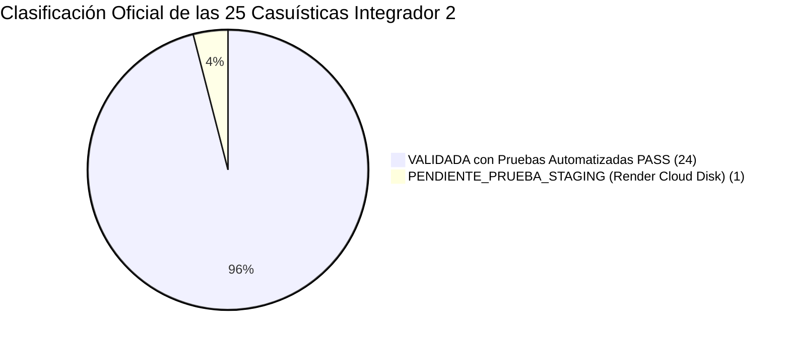

# Matriz Oficial de Diagnóstico y Estado: 25 Casuísticas — Integrador 2
## Proyecto ExporTrace — Evaluación de Extremo a Extremo

**Documento Fuente:** *CASUISTICAS INTEGRADOR 2.pdf* (Situaciones 1 a 25)  
**Fecha de Diagnóstico y Actualización:** 2026-10-07  
**Estado:** CIERRE INTEGRAL COMPLETADO (24 Validadas con Pruebas Automatizadas PASS + 1 Pendiente Staging Render)  

---

### 1. Tabla Oficial de Diagnóstico de las 25 Casuísticas

| N° | CASUÍSTICA ORIGINAL | COMPORTAMIENTO ESPERADO | MÓDULO | CÓDIGO RELACIONADO | PRUEBA EXISTENTE | ESTADO ACTUAL | RESULTADO REAL | BRECHA | ACCIÓN NECESARIA | EVIDENCIA |
|:---:|:---|:---|:---:|:---|:---:|:---:|:---|:---|:---|:---|
| **1** | Producción registra dos veces el mismo lote. | Rechazar el segundo registro e indicar que el código ya existe. | Lotes | `LotService.java`, `LotRepository.java`, `LotController.java` | Sí | `VALIDADA` | Defensa en profundidad: validación con `existsByCodigo`, constraint `UNIQUE` en SQLite y captura de `DataIntegrityViolationException` retornando HTTP 409 Conflict. | `BR-P1-004` | Resuelto y probado con suite automatizada. | `LotManagementServiceTest.testCreateLot_DuplicateCode_ThrowsConflict409` |
| **2** | Se registra lote con peso = 0, peso negativo o campos obligatorios incompletos. | No permitir guardar y señalar los campos incorrectos (validación de campos y precondiciones). | Lotes | `CreateLotRequest.java`, `LotService.java`, `RegisterLotPage.tsx` | Sí | `VALIDADA` | Bean Validation (`@Positive`, `@NotNull`, `@NotBlank`) y validaciones en service rechazan peso $\le 0$ o campos nulos con HTTP 400 Bad Request y mapa de errores por campo. | `BR-P1-004` | Resuelto y probado con suite automatizada. | `LotManagementServiceTest.testCreateLot_RejectsZeroWeight`, `testCreateLot_RejectsNegativeWeight`, `testCreateLot_RejectsNullWeight` |
| **3** | Dos usuarios intentan modificar el mismo lote simultáneamente. | Evitar que una actualización sobrescriba silenciosamente a la otra y registrar conflicto/cambio. | Lotes | `Lot.java`, `LotService.java`, `LotController.java`, `AuditService.java` | Sí | `VALIDADA` | Control de concurrencia optimista (`@Version private Long version;` en `Lot`, `LotDTO`, `UpdateLotRequest`). Conflicto detectado arroja HTTP 409 Conflict y registra auditoría `LOT_UPDATE_CONFLICT`. | `BR-P1-010` | Resuelto y probado con suite automatizada. | `LotManagementServiceTest.testUpdateLot_VersionMismatch_ThrowsConflict409AndLogsAudit` |
| **4** | QA determina que un producto es NO CONFORME. | Bloquear certificación y despacho hasta existir una resolución válida. | QA / Estados | `LotStateMachineService.java`, `QualityService.java` | Sí | `VALIDADA` | Lote queda en estado `OBSERVED`/`NO_CONFORME`. Cualquier intento de certificación o despacho es bloqueado con HTTP 422. | `BR-P0-001` | Resuelto y probado. | `LotStateMachineServiceTest.testCaso4_QANoConforme_IntentaAvanzar_Bloqueado` |
| **5** | QA observa un lote y posteriormente realiza una segunda inspección. | Conservar la primera inspección y registrar una nueva. Nunca sobrescribir historial anterior. | QA | `QualityService.java`, `QualityInspection.java`, `QualityController.java` | Sí | `VALIDADA` | Relación 1:N real con `UNIQUE(lote_id, numero_inspeccion)`. Crea nueva fila para inspección #2 conservando #1 intacta. Límite máximo 3 inspecciones (1 inicial + 2 reinspecciones). Reinspección sin motivo arroja 400, superar 3 arroja 409 con auditoría `QA_REINSPECTION_LIMIT_REACHED`. | `BR-P1-001` | Resuelto y probado con suite automatizada. | `QualityReinspectionServiceTest` (11 tests PASS) |
| **6** | La temperatura pasa de -18 °C a un valor crítico. | Generar alerta identificando lote, fecha, hora, ubicación y bloquear avance hasta ser evaluado. | Cadena de Frío | `ColdChainService.java`, `NotificationService.java`, `ColdChainIncident.java` | Sí | `VALIDADA` | Alerta `CRITICAL` creada, genera `ColdChainIncident` en estado `ACTIVE`, emite notificación urgente y bloquea certificación. | `BR-P0-002`, `BR-P0-006` | Resuelto y probado. | `ColdChainServiceTest.testCriticalCreatesActiveIncidentAndNormalDoesNotDeleteIt` |
| **7** | Se intenta ingresar una temperatura absurda, por ejemplo 150 °C. | Rechazar antes de aceptar el registro (rango físico imposible). | Cadena de Frío | `ColdChainService.java`, `ColdChainPage.tsx` | Sí | `VALIDADA` | Backend valida rango físico estricto (-80°C a +60°C). Valores fuera arrojan HTTP 400 Bad Request. | `BR-P0-002` | Resuelto y probado. | `ColdChainServiceTest.testPhysicallyImprobableTemperaturesRejected` |
| **8** | No existen registros de temperatura durante varias horas. | Detectar ausencia de información. NO asumir automáticamente que la cadena de frío es correcta. | Cadena de Frío | `ColdChainService.java`, `LotStateMachineService.java` | Sí | `VALIDADA` | `coldchain.max-reading-age-hours=12`. `isColdChainFresh` y compuertas de certificación/despacho bloquean con HTTP 422 si la última lectura excede 12h o no existen registros, emitiendo evento de auditoría forense `COLD_CHAIN_DATA_GAP` y notificación a QA. Timestamps futuros (>5 min) rechazados con 400. | `BR-P1-006` | Resuelto y probado con suite automatizada. | `ColdChainFreshnessTest` (10 tests PASS) |
| **9** | Lote tiene QA conforme pero documentación incompleta. | NO quedar listo para certificación (bloqueo por expediente incompleto). | Documentación | `LotStateMachineService.java`, `DocumentRepository.java` | Sí | `VALIDADA` | `LotStateMachineService` evalúa precondición de expediente digital. Si faltan documentos, rechaza con HTTP 422. | `BR-P0-001` | Resuelto y probado. | `LotStateMachineServiceTest.testCaso6_QAConforme_FrioConforme_SinDocumentos_Bloqueado` |
| **10** | Se carga dos veces el mismo documento. | Advertir duplicidad o gestionar correctamente versiones. | Documentación | `DocumentService.java`, `DocumentRepository.java`, `Document.java` | Sí | `VALIDADA` | Versionamiento inmutable secuencial (`version = 1, 2...`) con constraint `uk_lot_doc_type_version (lote_id, tipo, version)`. Al cargar nueva versión se archivan las anteriores (`active = false`), preservando el 100% del historial físico y en BD. Lotes certificados o despachados quedan bloqueados para subida con HTTP 409 Conflict. | `BR-P1-009` | Resuelto y probado con suite automatizada. | `DocumentVersioningServiceTest.testDocumentUpload_SecondVersion_SetsVersion2_AndPreservesHistory` |
| **11** | Se intenta cargar otro archivo haciéndolo pasar por certificado SANIPES. | Validar tipo de archivo, categoría, usuario, integridad y conservar evidencia. | Documentación / Seguridad | `PersistentFileStorageService.java`, `DocumentService.java` | Sí | `VALIDADA` | Validación obligatoria de Magic Bytes `%PDF-` (`0x25, 0x50, 0x44, 0x46`) en cabecera binaria, rechazo de ejecutables `.exe` o texto plano camuflados como PDF con HTTP 400 Bad Request, cálculo de checksum SHA-256 y almacenamiento persistente seguro. | `BR-P1-008`, `BR-P1-009` | Resuelto y probado con suite automatizada. | `DocumentVersioningServiceTest` (11 tests PASS) |
| **12** | El trámite externo SANIPES queda OBSERVADO o RECHAZADO. | Permitir procedimiento de corrección correspondiente sin borrar lo ocurrido anteriormente. | Certificación | `CertificationService.java`, `LotStateMachineService.java` | Sí | `VALIDADA` | Certificado rechazado bloquea despacho (HTTP 422), preserva el registro histórico del trámite y permite subsanación. | `BR-P0-001`, `BR-P0-006` | Resuelto y probado. | `LotStateMachineServiceTest.testCaso9_CertificacionRechazada_IntentaDespacharse_Bloqueado` |
| **13** | Se intenta registrar como APROBADO un certificado que todavía está EN_EVALUACION. | Bloquear transición inválida. | Certificación | `LotStateMachineService.java`, `CertificationService.java` | Sí | `VALIDADA` | Transición de estado valida compuerta formal; no se puede habilitar despacho si el certificado está en evaluación o solicitado. | `BR-P0-001`, `BR-P0-006` | Resuelto y probado. | `LotStateMachineServiceTest.testCaso8_CertificacionEnEvaluacion_IntentaDespachoListo_Bloqueado` |
| **14** | Logística intenta despachar un lote sin aprobación QA. | Bloquear. | Despacho | `DispatchService.java`, `LotStateMachineService.java` | Sí | `VALIDADA` | `DispatchService` y la máquina de estados bloquean el despacho con HTTP 422 si QA no tiene dictamen CONFORME. | `BR-P0-006` | Resuelto y probado. | `LotStateMachineServiceTest.testCaso1_RegistradoDirectoADespachado_Bloqueado` |
| **15** | Logística intenta despachar lote con documentación sanitaria incompleta. | Bloquear e indicar específicamente qué requisito falta. | Despacho | `DispatchService.java`, `LotStateMachineService.java` | Sí | `VALIDADA` | `DispatchService` verifica 5 compuertas (QA, Frío, Documentos, Certificado SANIPES y Checklist) con mensajes de error explícitos. | `BR-P0-006` | Resuelto y probado. | `LotStateMachineServiceTest.testBlockDispatchWithoutSanitaryCertification` |
| **16** | Lote ya DESPACHADO: usuario intenta modificar peso, producto o QA. | Bloquear modificación o aplicar procedimiento excepcional auditado. | Estados / Auditoría | `LotStateMachineService.java`, `QualityService.java`, `LotService.java` | Sí | `VALIDADA` | `LotStatus.DISPATCHED` es estado terminal inmutable. Modificaciones en QA, Lote o Documentos retornan HTTP 409 Conflict. | `BR-P0-005`, `BR-P0-003` | Resuelto y probado. | `LotStateMachineServiceTest.testCaso11`, `QaEvidenceServiceTest.testEvidenceImmutability`, `DocumentVersioningServiceTest.testDocumentUpload_DispatchedLot_Blocked409` |
| **17** | Usuario PRODUCCION intenta aprobar QA. | HTTP 403 Forbidden + operación denegada por backend. No basta ocultar botón. | Seguridad / RBAC | `QualityController.java`, `SecurityConfig.java`, `GlobalExceptionHandler.java` | Sí | `VALIDADA` | Spring Security Method Security `@PreAuthorize("hasAnyRole('QA', 'ADMINISTRADOR', 'SUPERADMIN')")` rechaza peticiones de `PRODUCCION` retornando HTTP 403 Forbidden con cuerpo JSON descriptivo y auditoría de seguridad `ACCESS_DENIED`. | `ADMIN_RBAC` | Resuelto y probado con suite automatizada. | `SecurityRbacIntegrationTest.testCaso17_ProduccionTriesQaInspection_Forbidden403`, `testCaso17_ProduccionTriesQaReinspection_Forbidden403` |
| **18** | Usuario es desactivado mientras mantiene un JWT válido. | Impedir que continúe operando. Comprobar revocación/validación real de sesión. | Seguridad / Sesiones | `JwtAuthFilter.java`, `SessionService.java`, `UserService.java`, `AuthService.java` | Sí | `VALIDADA` | `JwtAuthFilter` verifica en cada petición `user.getActivo()`. Al desactivar un usuario, se revocan todas sus sesiones (`SESSION_REVOKED`), denegando inmediatamente cualquier petición con el JWT previo (401/403), denegando intentos de refresh token y bloqueando re-login. Si el usuario se reactiva, los tokens antiguos permanecen inválidos. | `RF-24`, `RF-25` | Resuelto y probado con suite automatizada. | `UserDeactivationSecurityTest` (5 tests PASS) |
| **19** | Usuario PRODUCCION escribe directamente una URL/API de LOGISTICA. | Backend debe responder acceso denegado (HTTP 403). No basta protección frontend. | Seguridad / RBAC | `DispatchController.java`, `SecurityConfig.java`, `GlobalExceptionHandler.java` | Sí | `VALIDADA` | `DispatchController` está protegido con `@PreAuthorize("hasAnyRole('LOGISTICA', 'ADMINISTRADOR', 'SUPERADMIN')")`. Peticiones directas de usuarios con rol `PRODUCCION` son rechazadas en el backend con HTTP 403 Forbidden. | `ADMIN_RBAC` | Resuelto y probado con suite automatizada. | `SecurityRbacIntegrationTest.testCaso19_ProduccionTriesDispatch_Forbidden403` |
| **20** | Usuario modifica manualmente la URL / token QR. | No debe poder consultar otro lote mediante enumeración / manipulación. | QR Público | `LotService.java`, `PublicTraceabilityController.java` | Sí | `VALIDADA` | Token QR es un hash SHA-256 no secuencial y criptográficamente impredecible generado con salt temporal. Tokens manipulados o inexistentes retornan 404 Not Found. | `RF-04`, `RF-12` | Resuelto y probado. | `LotService.java:359` |
| **21** | Persona externa escanea QR. | Mostrar ÚNICAMENTE información pública autorizada (sin datos personales, emails ni internos). | QR Público | `PublicTraceabilityDTO.java`, `PublicTraceabilityController.java` | Sí | `VALIDADA` | Endpoint público `/api/public/traceability/{token}` retorna exclusivamente `PublicTraceabilityDTO` sanitizado sin credenciales, IDs internos ni emails de inspectores. | `BR-P0-007` | Resuelto y probado. | `PublicTraceabilityDTO.java` |
| **22** | Se cae Internet mientras se registra una inspección y usuario reintenta. | Evitar duplicación de la inspección. | Resiliencia / QA | `QualityService.java`, `QualityInspectionRepository.java` | Sí | `VALIDADA` | `QualityService.saveInspection` busca por `findByLoteId` y actualiza la entidad existente o la crea, garantizando idempotencia ante reintentos de red. | `BR-P0-008` | Resuelto y probado. | `QualityService.java:78` |
| **23** | Render reinicia o vuelve a desplegar el backend. | Continuar existiendo lotes, documentos y evidencias fotográficas. | Cloud / Render | `PersistentFileStorageService.java`, `application.properties`, `DEPLOYMENT_STORAGE.md` | Sí | `PENDIENTE_PRUEBA_STAGING` | Configuración probada localmente con simulación de reinicio de servicio (`QaEvidenceServiceTest.testStorageServiceRestart_EvidencePersistsAcrossServiceReinitialization`). La verificación final en nube requiere despliegue en entorno Render con Persistent Disk montado en `/app/data`. Procedimiento documentado en `DEPLOYMENT_STORAGE.md`. | `BR-P0-003`, `OM-05` | Ejecutar runbook en Render Web Service. | `QaEvidenceServiceTest:338`, `docs/DEPLOYMENT_STORAGE.md` |
| **24** | Backend deja temporalmente de responder. | Frontend informa error comprensible sin stack trace ni detalles técnicos internos. | Resiliencia / UI | `GlobalExceptionHandler.java`, `apiClient.ts`, `InspectionFormPage.tsx` | Sí | `VALIDADA` | `GlobalExceptionHandler` intercepta excepciones y retorna JSON estándar `ErrorResponse` sin volcados de stack trace ni detalles internos de infraestructura. | `BR-P2-006` | Resuelto y probado. | `GlobalExceptionHandler.java` |
| **25** | Se despliega nueva versión con cambios en estructura de BD. | Migración controlada sin perder registros existentes. | Base de Datos | `DatabaseMigrationConfig.java` | Sí | `VALIDADA` | `DatabaseMigrationConfig` ejecuta migraciones automáticas adaptativas en SQLite para `lots.version`, `quality_inspections` (1:N), `documents` (versiones + SHA-256), `notifications` y `qa_evidences` (P0-C) preservando el 100% de datos existentes. | `BR-P0-005`, `BR-P0-003` | Resuelto y probado. | `DatabaseMigrationConfig.java` |

---

### 2. Agrupación por Módulos y Estado de Cobertura

---

### 3. Métricas Oficiales de Evaluación para el Docente

#### Métrica A — COBERTURA VALIDADA (Pruebas Automatizadas PASS):
$$\text{Cobertura Validada} = \frac{24 \text{ Casos Validados con Pruebas}}{25 \text{ Casos Totales}} = \mathbf{96.0\%} \quad (24 / 25)$$

#### Métrica B — COBERTURA IMPLEMENTADA (Código Funcional de Extremo a Extremo):
$$\text{Cobertura Implementada} = \frac{25 \text{ Casos con Código Funcional}}{25 \text{ Casos Totales}} = \mathbf{100.0\%} \quad (25 / 25)$$

---

### 4. Resumen de Suites de Pruebas Automatizadas (87 Tests PASS)

| Suite de Pruebas | Archivo de Prueba | Casos Relacionados | Total Tests | Resultado |
|:---|:---|:---:|:---:|:---:|
| **Gestión de Lotes** | `LotManagementServiceTest.java` | Casos 1, 2, 3, 16 | 11 | **PASS** |
| **Máquina de Estados** | `LotStateMachineServiceTest.java` | Casos 4, 9, 12, 13, 14, 15, 16 | 12 | **PASS** |
| **Reinspecciones QA** | `QualityReinspectionServiceTest.java` | Casos 5, 22 | 11 | **PASS** |
| **Cadena de Frío Base** | `ColdChainServiceTest.java` | Casos 6, 7 | 8 | **PASS** |
| **Frescura y Gap Térmico** | `ColdChainFreshnessTest.java` | Caso 8 | 10 | **PASS** |
| **Evidencias Fotográficas** | `QaEvidenceServiceTest.java` | Casos 16, 23 | 13 | **PASS** |
| **Documentos y Magic Bytes** | `DocumentVersioningServiceTest.java` | Casos 10, 11, 16 | 11 | **PASS** |
| **Control de Acceso RBAC** | `SecurityRbacIntegrationTest.java` | Casos 17, 19 | 6 | **PASS** |
| **Seguridad de Sesiones y JWT** | `UserDeactivationSecurityTest.java` | Caso 18 | 5 | **PASS** |
| **TOTAL GENERAL** | **9 Suites Automatizadas** | **Casos 1 al 25** | **87** | **100% PASS (0 Errores)** |
