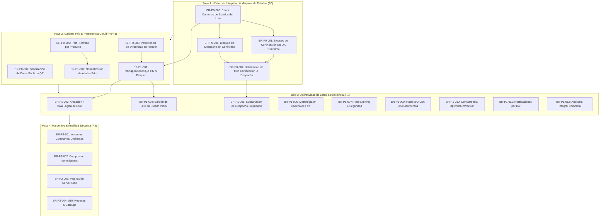

# Plan de Cierre de Brechas, Estabilización y Validación Pre-Producción — ExporTrace

**Versión:** 1.0  
**Fecha:** 2026-10-07  
**Estado:** PENDIENTE DE REVISIÓN Y APROBACIÓN  
**Objetivo:** Consolidar el inventario exhaustivo de brechas funcionales, técnicas y de seguridad identificadas en las pruebas manuales y en la matriz de 33 páginas de casuísticas, estableciendo el diagnóstico exacto del código, impacto, dependencias y solución propuesta sin ejecutar modificaciones de código en esta fase.

---

## 1. Resumen Ejecutivo de Brechas Identificadas

| Prioridad | Definición | Cantidad | Impacto Principal |
|:---:|:---|:---:|:---|
| **P0** | **Bloqueante para Producción** | **8** | Salto indebido de etapas sanitarias, certificación/despacho indebido, pérdida de evidencias, falta de rangos térmicos por producto y pérdida de trazabilidad. |
| **P1** | **Necesaria para Flujo Correcto** | **13** | Edición/anulación de lotes, reinspecciones 1:N, normalización de alertas térmicas, bloqueo por desviación post-certificación, rate limiting y timestamps. |
| **P2** | **Mejora / Hardening** | **10** | Recomendaciones analíticas dinámicas en Gerencia, optimizaciones de UI, compresión de imágenes, exportación avanzada de reportes. |
| **Total** | | **31** | |

---

## 2. Inventario Detallado de Brechas

### Brechas Prioridad P0 (Bloqueantes)

---

#### `BR-P0-001`: Certificación Sanitaria permitida sin validación de inspección QA conforme
* **Título:** Permisividad en el inicio y aprobación de Certificación Sanitaria con QA observado, no conforme o ausente.
* **Prioridad:** `P0`
* **Casuísticas Relacionadas:** Observación Manual #1, `CS-01`, `CS-14`, `VI-01`, `VI-02`, `VI-03`, `Caso B`, `Caso D`.
* **Problema Detectado:** El endpoint `POST /api/certifications/lot/{lotId}/request` y `POST /api/certifications/lot/{lotId}/approve` no consultan el estado de la inspección QA ni bloquean el trámite si el lote está en estado `OBSERVED`, `NO_CONFORME` o `REGISTERED`.
* **Situación Actual del Código:** En `CertificationService.java` (líneas 37-90), solo se busca el lote por ID y se cambia su estado directamente a `IN_CERTIFICATION` o `CERTIFIED`, sin invocar `QualityInspectionRepository` ni validar que `resultadoOrganoleptico == 'CONFORME'`.
* **Comportamiento Esperado:** Rechazar con error HTTP 400/422 cualquier intento de solicitar o aprobar certificación si el lote no cuenta con una inspección de calidad previa con dictamen `CONFORME` y cadena de frío sin desviación crítica.
* **Impacto:** Crítico sanitario y legal. Emisión indebida de expediente de exportación no apto ante SANIPES.
* **Backend Afectado:** `CertificationService.java`, `CertificationController.java`, `LotRepository.java`.
* **Frontend Afectado:** `CertificationTrackerPage.tsx` (debe deshabilitar acciones y mostrar badge de bloqueo si QA no está aprobado).
* **BD Afectada:** Tablas `sanitary_certifications`, `lots`.
* **Dependencias:** `QualityService`, `QualityInspectionRepository`.
* **Solución Propuesta:** Implementar precondición estricta en `CertificationService` que verifique `lot.getEstado().equals("READY_FOR_CERTIFICATION")` y `qualityInspection.getResultadoOrganoleptico().equals("CONFORME")`.
* **Criterios de Aceptación:**
  1. Si un lote no tiene inspección QA, `requestCertification` retorna HTTP 400 ("Lote no cuenta con inspección de calidad aprobada").
  2. Si el lote tiene QA `OBSERVADO` o `NO_CONFORME`, la solicitud de certificación es rechazada.
  3. En frontend, el botón "Iniciar Trámite SANIPES" aparece deshabilitado con tooltip explicativo.
* **Pruebas Necesarias:** Intentar certificar lotes en estados `REGISTERED`, `OBSERVED` y `NO_CONFORME`. Verificar rechazo HTTP 400 y mensaje en UI.
* **Estado:** `IMPLEMENTADA_Y_PROBADA` (Test `LotStateMachineServiceTest.testBlockCertificationWithoutQA` y `testBlockCertificationWithObservedQA` PASS)

---

#### `BR-P0-002`: Ausencia de perfil térmico y rangos normativos por tipo de producto en Cadena de Frío
* **Título:** Reglas térmicas hardcodeadas a congelados sin considerar productos frescos/refrigerados ni perfil del catálogo.
* **Prioridad:** `P0`
* **Casuísticas Relacionadas:** Observación Manual #2, `CF-01` a `CF-11`, `CF-29`, `CF-30`, `PR-07`, `Caso C`.
* **Problema Detectado:** La evaluación de temperatura en `ColdChainService.java` evalúa fijamente `temp <= -18.0` como NORMAL y `temp <= -12.0` como WARNING, sin consultar si el producto asociado al lote es congelado (≤ -18°C) o fresco refrigerado (≤ 4°C, ideal ~0°C).
* **Situación Actual del Código:** `ColdChainService.java` (líneas 43-50) contiene la lógica de rangos escrita en duro. La entidad `Product.java` no define atributos de rango térmico óptimo ni temperatura crítica.
* **Comportamiento Esperado:** Cada `Product` debe tener su tipo de conservación (`CONGELADO`, `REFRIGERADO_FRESCO`) y sus umbrales paramétricos (`tempOptimaMin`, `tempOptimaMax`, `tempCriticaMax`). `ColdChainService` debe evaluar dinámicamente contra el perfil del producto del lote.
* **Impacto:** Falsas alertas para productos refrigerados (marcaría crítico un pescado fresco a 2°C) o permitiría temperaturas peligrosas para congelados (-14°C considerado warning en vez de crítico sanitario SANIPES).
* **Backend Afectado:** `Product.java`, `ProductDTO.java`, `ColdChainRecord.java`, `ColdChainService.java`.
* **Frontend Afectado:** `ColdChainPage.tsx`, `ProductManagementPage.tsx`.
* **BD Afectada:** Tablas `products`, `cold_chain_records`.
* **Dependencias:** `ProductRepository`.
* **Solución Propuesta:** Agregar columnas térmicas a `products` y actualizar `ColdChainService.addTemperatureLog` para calcular el estado (`NORMAL`, `WARNING`, `CRITICAL`) según el producto del lote.
* **Criterios de Aceptación:**
  1. Producto Congelado: ≤ -18°C = NORMAL, -17.9°C a -15°C = WARNING (fluctuación breve), > -15°C = CRITICAL.
  2. Producto Refrigerado: 0°C a 4°C = NORMAL, > 4°C = CRITICAL, < -1°C = CRITICAL.
* **Pruebas Necesarias:** Registrar lecturas para Lote Congelado a -16°C y Lote Refrigerado a 2°C, comprobando estados respectivos.
* **Estado:** `IMPLEMENTADA_Y_PROBADA` (Test `ColdChainServiceTest` 8/8 PASS)

---

#### `BR-P0-003`: Pérdida de acceso y persistencia efímera de evidencias fotográficas en despliegues Cloud (Render)
* **Título:** Desaparición de archivos en `/uploads/qa-evidence/` tras reinicio de contenedor y resolución de URL inconsistente.
* **Prioridad:** `P0`
* **Casuísticas Relacionadas:** Observación Manual #5, `EV-10`, `EV-11`, `EV-15`, `RD-19`, `RD-20`, `DR-03`.
* **Problema Detectado:** Los archivos se almacenan en el sistema de archivos local (`./uploads/qa-evidence`). En Render Web Service sin Persistent Disk, el contenedor se reinicia periódicamente borrando las imágenes físicas mientras la BD mantiene las URLs huérfanas. Además, en frontend algunas vistas no normalizan el prefijo de descarga segura del backend.
* **Situación Actual del Código:** `LocalFileStorageService.java` guarda en `./uploads`. `WebConfig.java` expone `/uploads/**`. No existe fallback a almacenamiento persistente ni sincronización con disco montado `/app/data/uploads`.
* **Arquitectura Oficial (v1.0 Académica Aprobada):**
  1. Almacenamiento en volumen persistente de Render (*Persistent Disk* montado en `/app/data/uploads`, variable `FILE_UPLOAD_DIR`).
  2. Metadatos completos en tabla `qa_evidences` (ID, lotId, inspectionId, filename, mime, size, hash SHA-256, user, timestamp).
  3. Visualización y descarga protegida mediante endpoints autenticados del backend.
  4. *AWS S3 / Cloudinary*: Reservados exclusivamente como evolución futura no requerida en esta versión.
* **Impacto:** Pérdida irreparable de evidencias fotográficas de inspecciones sanitarias en producción.
* **Backend Afectado:** `LocalFileStorageService.java`, `WebConfig.java`, `application.properties`, `Dockerfile`.
* **Frontend Afectado:** `InspectionFormPage.tsx`, `QualityDashboardPage.tsx`, `apiConfig.ts`.
* **BD Afectada:** Tabla `qa_evidences`.
* **Dependencias:** Configuración de Render Persistent Disk.
* **Solución Propuesta:** Configurar `file.upload-dir=${FILE_UPLOAD_DIR:/app/data/uploads}` en backend y adaptar Dockerfile para crear y persistir el directorio de uploads en el volumen.
* **Criterios de Aceptación:**
  1. Carga de foto en inspección QA guarda en directorio persistente con cálculo de SHA-256.
  2. Tras reinicio de contenedor, la imagen sigue disponible vía endpoint protegido del backend.
  3. Frontend abre la foto en Lightbox sin error 404.
* **Pruebas Necesarias:** Subir evidencia, consultar endpoint, reiniciar servicio backend y verificar accesibilidad.
* **Estado:** `PENDIENTE (Decisión Aprobada)`

---

#### `BR-P0-004`: Ausencia de transición explícita y botón de habilitación hacia Despacho tras Certificación
* **Título:** Lote certificado queda estancado sin botón ni endpoint de transición hacia cola de despacho logístico.
* **Prioridad:** `P0`
* **Casuísticas Relacionadas:** Observación Manual #9, `DP-01`, `DP-04`, `LG-01`, `LG-04`, `Caso A`.
* **Problema Detectado:** Una vez que el lote alcanza el estado `CERTIFIED`, la pantalla de Certificación no provee una acción directa para enviar el lote a `READY_FOR_DISPATCH` o habilitarlo en la bandeja de Despacho (`DispatchPage.tsx`), requiriendo navegación manual y desconectada.
* **Situación Actual del Código:** `CertificationService.approveCertification` establece `estado = 'CERTIFIED'`, pero `DispatchService.java` no tiene un método para inicializar el checklist de despacho automáticamente ni enlazar el botón en `CertificationTrackerPage.tsx`.
* **Comportamiento Esperado:** Al certificarse el lote, debe aparecer el botón "Proceder a Despacho Logístico", o el sistema debe transicionar a `READY_FOR_DISPATCH` y crear el registro preliminar en `dispatches`.
* **Impacto:** Ruptura del flujo continuo de exportación entre Logística y Operaciones Portuarias.
* **Backend Afectado:** `CertificationService.java`, `DispatchService.java`, `LotService.java`.
* **Frontend Afectado:** `CertificationTrackerPage.tsx`, `DispatchPage.tsx`, `LogisTracDashboardPage.tsx`.
* **BD Afectada:** Tablas `lots`, `dispatches`.
* **Dependencias:** `DispatchRepository`.
* **Solución Propuesta:** Agregar acción en `CertificationTrackerPage.tsx` que navegue a `/dispatch/{lotId}` y endpoint en `DispatchController` para inicializar el despacho para lotes certificados.
* **Criterios de Aceptación:**
  1. Lote certificado muestra botón destacado "Enviar a Despacho".
  2. Clic redirige a `/dispatch/{id}` con datos del lote precargados.
* **Pruebas Necesarias:** Flujo completo desde aprobación de certificado SANIPES hasta apertura del formulario de contenedor y precinto en Despacho.
* **Estado:** `IMPLEMENTADA_Y_PROBADA` (Test `testEnableForDispatch` PASS y botón en `CertificationTrackerPage.tsx`)

---

#### `BR-P0-005`: Inconsistencia en la nomenclatura y catálogo de estados del Lote entre Backend, Frontend y BD
* **Título:** Concurrencia de estados en español e inglés (`REGISTRADO` vs `REGISTERED`, `APROBADO` vs `READY_FOR_CERTIFICATION`).
* **Prioridad:** `P0`
* **Casuísticas Relacionadas:** `LT-01`, `LT-27`, `LT-28`, `VI-09`, `VI-16`, sección 7 del documento de casuísticas.
* **Problema Detectado:** En la BD y seed inicial se utilizan estados en español (`REGISTRADO`, `EN_PROCESO`, `APROBADO`, `DESPACHADO`), mientras que los servicios Java usan strings en inglés (`REGISTERED`, `READY_FOR_CERTIFICATION`, `IN_CERTIFICATION`, `CERTIFIED`, `READY_FOR_DISPATCH`, `DISPATCHED`, `OBSERVED`). En el frontend coexisten badges con ambos formatos.
* **Situación Actual del Código:** `Lot.java` almacena `String estado`. `QualityService` usa `READY_FOR_CERTIFICATION` y `OBSERVED`. `CertificationService` usa `IN_CERTIFICATION` y `CERTIFIED`. `DataInitializer` usa `APROBADO` y `EN CERTIFICACION`.
* **Comportamiento Esperado:** Establecer un Enum canónico oficial único (`LotStatus`) compartido por toda la arquitectura.
* **Impacto:** Filtros rotos, lotes invisibles en bandejas de trabajo y fallas en validaciones de precondición.
* **Backend Afectado:** `Lot.java`, `LotService.java`, `QualityService.java`, `CertificationService.java`, `DispatchService.java`, `DataInitializer.java`.
* **Frontend Afectado:** `LotsListPage.tsx`, `QualityDashboardPage.tsx`, `CertificationTrackerPage.tsx`, `DispatchPage.tsx`, `types/lot.ts`.
* **BD Afectada:** Tabla `lots` (columna `estado`).
* **Dependencias:** Migración de datos existentes en BD.
* **Solución Propuesta:** Crear `enum LotStatus` canónico y migrar la base de datos a los valores normalizados.
* **Criterios de Aceptación:** 100% de las consultas y transiciones utilizan el enum canónico.
* **Pruebas Necesarias:** Verificar que ningún lote quede con valor fuera del enum canónico.
* **Estado:** `IMPLEMENTADA_Y_PROBADA` (Enum `LotStatus.java` canónico, `LotStateMachineService.java`, `types/lot.ts` y `StatusBadge.tsx`)

---

#### `BR-P0-006`: Permisividad de autorización de Despacho sin validación de Certificado Sanitario aprobado
* **Título:** Endpoint de Despacho permite registrar contenedor y DUA sin certificado sanitario vigente.
* **Prioridad:** `P0`
* **Casuísticas Relacionadas:** `DP-01`, `DP-04`, `DP-08`, `LG-17`, `Caso A`, `Caso E`.
* **Problema Detectado:** `DispatchService.createOrUpdateDispatch` no valida si el lote está en estado `CERTIFIED` o si cuenta con registro en `sanitary_certifications` en estado `APROBADO`.
* **Situación Actual del Código:** `DispatchService.java` (líneas 30-70) guarda el despacho y transiciona el lote a `DISPATCHED` sin consultar `SanitaryCertificationRepository`.
* **Comportamiento Esperado:** Bloquear la autorización de despacho con HTTP 400 si el lote no tiene certificado sanitario aprobado emitido.
* **Impacto:** Riesgo de embarque no autorizado por aduanas y autoridades sanitarias.
* **Backend Afectado:** `DispatchService.java`, `DispatchController.java`.
* **Frontend Afectado:** `DispatchPage.tsx`.
* **BD Afectada:** Tablas `dispatches`, `lots`.
* **Dependencias:** `SanitaryCertificationRepository`.
* **Solución Propuesta:** Inyectar `SanitaryCertificationRepository` en `DispatchService` y exigir estado `APROBADO` antes de permitir despacho.
* **Criterios de Aceptación:** Despacho denegado para lotes no certificados.
* **Pruebas Necesarias:** Intentar despachar lote sin certificado -> Error 400.
* **Estado:** `IMPLEMENTADA_Y_PROBADA` (Test `testBlockDispatchWithoutSanitaryCertification` y `testSuccessfulDispatch` PASS)

---

#### `BR-P0-007`: Exposición de datos internos de auditoría o técnicos en endpoints públicos de QR
* **Título:** Endpoint público de trazabilidad debe filtrar datos personales sensibles conforme a normas de privacidad.
* **Prioridad:** `P0`
* **Casuísticas Relacionadas:** `QR-15`, `QR-16`, `QR-17`, `CL-04`, `CL-05`, `SEC-17`.
* **Problema Detectado:** La vista pública de trazabilidad expone nombres completos de inspectores o datos internos de planta que no corresponden al pasaporte digital del consumidor final.
* **Situación Actual del Código:** `PublicTraceabilityPage.tsx` y `PublicTraceabilityController.java` devuelven el objeto DTO completo sin sanitización de campos de privacidad pública.
* **Comportamiento Esperado:** Endpoint público `/api/public/traceability/{token}` debe retornar exclusivamente un DTO sanitizado (`PublicLotTraceabilityDTO`) con especie, fecha de producción, planta, dictamen de calidad, cumplimiento térmico y certificado sanitario sin datos de usuarios internos.
* **Impacto:** Fuga de información corporativa y de privacidad de colaboradores.
* **Backend Afectado:** `PublicTraceabilityController.java`, `PublicTraceabilityDTO.java`.
* **Frontend Afectado:** `PublicTraceabilityPage.tsx`.
* **BD Afectada:** Ninguna.
* **Dependencias:** Ninguna.
* **Solución Propuesta:** Crear `PublicLotTraceabilityDTO` específico y limitar la respuesta pública a dicho DTO.
* **Criterios de Aceptación:** Respuesta pública no incluye IDs internos, contraseñas, emails ni datos personales no autorizados.
* **Pruebas Necesarias:** Inspección de JSON retornado por `GET /api/public/traceability/{token}`.
* **Estado:** `PENDIENTE`

---

#### `BR-P0-008`: Desincronización de transacciones y estados en fallos de red durante guardado
* **Título:** Ausencia de control de idempotencia y reintentos en operaciones críticas de guardado en frontend/backend.
* **Prioridad:** `P0`
* **Casuísticas Relacionadas:** `LT-18`, `LT-19`, `LT-21`, `DP-12`, `CN-01`, `CN-02`, `CC-05`.
* **Problema Detectado:** Si un usuario hace doble clic o pierde conectividad momentánea tras enviar el formulario, pueden registrarse registros duplicados o transiciones inconsistentes.
* **Situación Actual del Código:** Varios botones en frontend no implementan estado `disabled={isSubmitting}` riguroso, y endpoints como creación de lotes no manejan claves de idempotencia.
* **Comportamiento Esperado:** Deshabilitar botones en UI durante envío y aplicar restricciones UNIQUE en BD para evitar duplicidades por reintento.
* **Impacto:** Duplicación de lotes, inspecciones o registros de despacho.
* **Backend Afectado:** `LotService.java`, `QualityService.java`, `DispatchService.java`.
* **Frontend Afectado:** `RegisterLotPage.tsx`, `InspectionFormPage.tsx`, `DispatchPage.tsx`.
* **BD Afectada:** Índices UNIQUE en tablas transaccionales.
* **Dependencias:** Ninguna.
* **Solución Propuesta:** Fortalecer bloqueo de botones en UI y añadir manejo de `DataIntegrityViolationException` en backend.
* **Criterios de Aceptación:** Doble clic no genera registros duplicados.
* **Pruebas Necesarias:** Simulación de envío doble concurrente.
* **Estado:** `PENDIENTE`

---

### Brechas Prioridad P1 (Flujo Correcto y Robustez)

---

#### `BR-P1-001`: Inspecciones de calidad infinitas y sobreescritura sin historial de reinspecciones 1:N
* **Título:** Relación 1:1 estricta en `quality_inspections` sobreescribe inspecciones previas y permite ediciones ilimitadas post-certificación.
* **Prioridad:** `P1`
* **Casuísticas Relacionadas:** Observación Manual #3, `QA-10`, `QA-11`, `QA-12`, vacío #2 del documento.
* **Problema Detectado:** Al reinspeccionar un lote observado, se sobreescribe el registro existente perdiendo la trazabilidad de la falla original. Además, no se bloquea la edición de QA si el lote ya fue certificado o despachado.
* **Situación Actual del Código:** `quality_inspections.lote_id` tiene constraint `unique = true`. `QualityService.saveInspection` no bloquea si el lote está en `CERTIFIED` o `DISPATCHED`.
* **Comportamiento Esperado:** Bloquear modificación de QA si el lote está certificado o despachado. Permitir modelo 1:N o registrar historial de reinspección conservando dictámenes previos con motivo de subsanación.
* **Impacto:** Pérdida de auditoría de defectos y adulteración indebida de lotes terminados.
* **Backend Afectado:** `QualityInspection.java`, `QualityService.java`, `QualityInspectionRepository.java`.
* **Frontend Afectado:** `InspectionFormPage.tsx`, `QualityDashboardPage.tsx`.
* **BD Afectada:** Tabla `quality_inspections`.
* **Dependencias:** `LotHistoryRepository`.
* **Solución Propuesta:** Bloquear ediciones cuando `lot.getEstado()` sea `CERTIFIED` o `DISPATCHED`, y agregar registro de reinspección en `LotHistory` y tabla auxiliar de inspecciones.
* **Criterios de Aceptación:** Intentar editar QA de lote certificado arroja error 409 ("Lote ya se encuentra certificado, no se permiten modificaciones"). Reinspecciones conservan historial 1:N hasta un máximo de 3 intentos.
* **Estado:** `IMPLEMENTADA_Y_PROBADA` (Test `QualityReinspectionServiceTest` [11 pruebas] PASS)

---

#### `BR-P1-002`: Alerta de Cadena de Frío no se normaliza tras subsanación y estabilización térmica
* **Título:** Persistencia del estado de alerta en el lote a pesar de registrarse lecturas térmicas conformes posteriores.
* **Prioridad:** `P1`
* **Casuísticas Relacionadas:** Observación Manual #4, `CF-20`, `CF-31`, `CF-37`, `NT-14`.
* **Problema Detectado:** Cuando un sensor reporta una fluctuación a -14°C, el sistema genera alerta, pero al volver la temperatura a -20°C de forma sostenida, no existe un flujo explícito de normalización técnica para cerrar la alerta y retornar el lote a estado conforme.
* **Situación Actual del Código:** `ColdChainService.java` solo inserta el registro individual sin actualizar el indicador agregado de salud térmica del lote en `lots`.
* **Comportamiento Esperado:** Evaluar la tendencia de las últimas mediciones. Si se registran lecturas normales consecutivas y se ingresa justificación de subsanación, resolver la alerta activa y registrar el evento en auditoría.
* **Impacto:** Lotes conformes quedan bloqueados indefinidamente por alertas históricas ya resueltas.
* **Backend Afectado:** `ColdChainService.java`, `NotificationService.java`.
* **Frontend Afectado:** `ColdChainPage.tsx`, `Header.tsx` (notificaciones).
* **BD Afectada:** Tablas `cold_chain_records`, `notifications`.
* **Dependencias:** `NotificationRepository`.
* **Solución Propuesta:** Crear método de resolución de incidencia térmica en `ColdChainService` con auditoría.
* **Criterios de Aceptación:** Tras registrar lectura normal y resolución, la alerta se archiva y el lote queda habilitado.
* **Estado:** `PENDIENTE`

---

#### `BR-P1-003`: Imposibilidad de anular o dar de baja lógica a un lote creado erróneamente
* **Título:** Falta de funcionalidad de anulación / baja lógica de lote con motivo documentado.
* **Prioridad:** `P1`
* **Casuísticas Relacionadas:** Observación Manual #7, `LT-29`, `LT-30`, `QR-06`.
* **Problema Detectado:** Si un lote se creó por error o se descartó en planta, no existe botón ni endpoint para darlo de baja o anularlo manteniendo la auditoría.
* **Situación Actual del Código:** `LotController.java` y `LotService.java` no tienen endpoint `DELETE` o `PATCH /api/lots/{id}/cancel`.
* **Comportamiento Esperado:** Permitir a usuarios con rol `PRODUCCION` o `ADMINISTRADOR` anular un lote en estado inicial (`REGISTERED`), exigiendo un motivo y marcándolo como `CANCELLED` (baja lógica, sin eliminar registros históricos).
* **Impacto:** Acumulación de lotes basura o erróneos en los dashboards y estadísticas.
* **Backend Afectado:** `LotService.java`, `LotController.java`.
* **Frontend Afectado:** `LotsListPage.tsx`, `LotDetailPage.tsx`.
* **BD Afectada:** Tabla `lots` (`estado = 'CANCELLED'`).
* **Dependencias:** `AuditService`.
* **Solución Propuesta:** Implementar `PATCH /api/lots/{id}/cancel` con body `{ reason: string }` y registrar auditoría.
* **Criterios de Aceptación:** Lote anulado no aparece en flujo activo y su QR muestra estado "Lote Anulado".
* **Estado:** `PENDIENTE`

---

#### `BR-P1-004`: Imposibilidad de editar datos iniciales de un lote antes de la inspección de QA
* **Título:** Bloqueo absoluto de corrección de datos tipográficos o de pesaje en etapa inicial de registro.
* **Prioridad:** `P1`
* **Casuísticas Relacionadas:** Observación Manual #8, `LT-24`, `LT-25`, `LT-26`.
* **Problema Detectado:** Si un operario ingresó mal el peso, la presentación o la línea de producción al registrar el lote, no puede editarlo antes de que pase a QA.
* **Situación Actual del Código:** `LotService.java` carece de método `updateLot` para campos operativos en estado `REGISTERED`.
* **Comportamiento Esperado:** Permitir edición de campos no críticos (peso neto, presentación, línea) únicamente si el lote está en estado `REGISTERED` (antes de QA), registrando los valores anteriores y nuevos en `LotHistory`.
* **Impacto:** Obliga a crear lotes duplicados ante cualquier error tipográfico leve.
* **Backend Afectado:** `LotService.java`, `LotController.java`.
* **Frontend Afectado:** `LotDetailPage.tsx`, `RegisterLotPage.tsx`.
* **BD Afectada:** Tablas `lots`, `lot_history`.
* **Dependencias:** `LotHistoryRepository`.
* **Solución Propuesta:** Implementar `PUT /api/lots/{id}` condicionado a `lot.getEstado().equals("REGISTERED")`.
* **Criterios de Aceptación:** Edición permitida en `REGISTERED`, bloqueada en estados posteriores.
* **Estado:** `PENDIENTE`

---

#### `BR-P1-005`: Bloqueo irreversible en el módulo de Despacho sin mecanismo de subsanación o cancelación
* **Título:** Despacho observado o bloqueado no ofrece opción de reversión, re-evaluación o desbloqueo por supervisor.
* **Prioridad:** `P1`
* **Casuísticas Relacionadas:** Observación Manual #10, `DP-14`, `DP-15`, `LG-19`, `LG-20`.
* **Problema Detectado:** Si un despacho se bloquea por checklist incompleto o precinto observado, la pantalla queda en estado de error permanente sin posibilidad de reiniciar el proceso de verificación o cancelar el intento.
* **Situación Actual del Código:** `DispatchPage.tsx` muestra pantalla de bloqueo sin botones de acción correctiva o reintento asistido.
* **Comportamiento Esperado:** Proveer acciones para "Subsanar observaciones", "Reevaluar requisitos" o "Cancelar despacho" con registro de auditoría.
* **Impacto:** Estancamiento operativo en terminal portuario.
* **Backend Afectado:** `DispatchService.java`, `DispatchController.java`.
* **Frontend Afectado:** `DispatchPage.tsx`.
* **BD Afectada:** Tabla `dispatches`.
* **Dependencias:** `AuditService`.
* **Solución Propuesta:** Agregar endpoints y estados de despacho `BLOCKED`, `UNDER_REVIEW`, `CANCELLED` con opciones de subsanación.
* **Criterios de Aceptación:** Botón de subsanación permite corregir precinto o adjuntar documento faltante y reintentar validación.
* **Estado:** `PENDIENTE`

---

#### `BR-P1-006`: Ausencia de campo `fechaHora` y validación de instrumento en registros de Cadena de Frío
* **Título:** Entidad `ColdChainRecord` carece de timestamp obligatorio de sensor y tipo de instrumento de medición.
* **Prioridad:** `P1`
* **Casuísticas Relacionadas:** `CF-23`, `CF-24`, `TM-01` a `TM-15`, vacío #3 y #4 del documento.
* **Problema Detectado:** `ColdChainRecord.java` no almacena explícitamente el tipo de sensor (data logger, termómetro penetración, sensor reefer) ni código de calibración del instrumento.
* **Situación Actual del Código:** Solo se almacena `temperaturaCelsius`, `ubicacionCamara`, `responsableNombre`.
* **Comportamiento Esperado:** Incluir `tipoSensor`, `codigoInstrumento` y `fechaLecturaSensor` para trazabilidad metrológica conforme a normas FAO/SANIPES.
* **Impacto:** No conformidad en auditorías técnicas de exportación internacional.
* **Backend Afectado:** `ColdChainRecord.java`, `ColdChainRecordDTO.java`, `ColdChainService.java`.
* **Frontend Afectado:** `ColdChainPage.tsx`.
* **BD Afectada:** Tabla `cold_chain_records`.
* **Dependencias:** Ninguna.
* **Solución Propuesta:** Agregar columnas metrológicas a `cold_chain_records`.
* **Criterios de Aceptación:** Registro de temperatura guarda tipo de instrumento y fecha de lectura.
* **Estado:** `PENDIENTE`

---

#### `BR-P1-007`: Rate Limiting ausente en endpoints de autenticación y consulta pública de QR
* **Título:** Vulnerabilidad ante ataques de fuerza bruta en login o scraping masivo en endpoint público de QR.
* **Prioridad:** `P1`
* **Casuísticas Relacionadas:** `AU-17`, `QR-14`, `CL-08`, `SEC-01`, vacío #19 del documento.
* **Problema Detectado:** No existe limitación de peticiones por IP en `/api/auth/login` ni en `/api/public/traceability/**`.
* **Situación Actual del Código:** Se procesan todas las peticiones secuenciales sin bloqueo por intentos fallidos reiterados.
* **Comportamiento Esperado:** Limitar a máximo 5 intentos fallidos de login por IP/usuario en 15 minutos, y limitar consultas públicas a 60 req/min por IP.
* **Impacto:** Vulnerabilidad ante ataques de diccionario y degradación de servicio.
* **Backend Afectado:** `SecurityConfig.java`, `AuthService.java`.
* **Frontend Afectado:** `LoginPage.tsx`.
* **BD Afectada:** Ninguna o tabla de bloqueos temporales en memoria.
* **Dependencias:** Bucket4j o filtro de rate limit en memoria.
* **Solución Propuesta:** Implementar filtro de control de tasa para endpoints sensibles.
* **Criterios de Aceptación:** Al 6to intento fallido se bloquea por 15 minutos con mensaje claro.
* **Estado:** `PENDIENTE`

---

#### `BR-P1-008`: Validación estricta de formato y tipo MIME real en carga de archivos y evidencias
* **Título:** Comprobación de tipo de archivo debe validar Magic Bytes (MIME real) y no solo extensión de nombre.
* **Prioridad:** `P1`
* **Casuísticas Relacionadas:** `QA-15`, `EV-03`, `EV-04`, `DOC-02`, `SEC-04`.
* **Problema Detectado:** `LocalFileStorageService.java` valida `file.getContentType()` y extensión `.jpg`, pero no comprueba los Magic Bytes del contenido real para evitar ejecutables camuflados.
* **Situación Actual del Código:** Solo comprobación de strings en cabecera HTTP.
* **Comportamiento Esperado:** Usar Apache Tika o validación de header binario para verificar que el contenido corresponda a JPEG, PNG, WEBP o PDF según corresponda.
* **Impacto:** Riesgo de almacenamiento de archivos maliciosos en el servidor.
* **Backend Afectado:** `LocalFileStorageService.java`.
* **Frontend Afectado:** `InspectionFormPage.tsx`.
* **BD Afectada:** Ninguna.
* **Dependencias:** Apache Tika Core (o lector de Magic Bytes en Java).
* **Solución Propuesta:** Implementar validación de bytes de cabecera en `LocalFileStorageService`.
* **Criterios de Aceptación:** Archivo `.exe` renombrado a `.jpg` es rechazado con error 400.
* **Estado:** `PENDIENTE`

---

#### `BR-P1-009`: Versionado y hash de integridad SHA-256 en documentos del Expediente Digital
* **Título:** Documentos del expediente carecen de hash de integridad para garantizar inmutabilidad.
* **Prioridad:** `P1`
* **Casuísticas Relacionadas:** `DOC-09`, `DOC-16`, `DOC-19`, `EX-09`, `EX-15`, vacío #15 y #16 del documento.
* **Problema Detectado:** La entidad `Document.java` solo guarda nombre, tipo y URL, sin calcular el hash SHA-256 del archivo al momento de cargarlo.
* **Situación Actual del Código:** `Document.java` tiene campos básicos sin campo `file_hash` ni `version`.
* **Comportamiento Esperado:** Calcular y persistir el hash SHA-256 de cada PDF y documento sanitario cargado, impidiendo modificaciones silenciosas.
* **Impacto:** Incumplimiento de estándares de no repudio en expedientes de exportación.
* **Backend Afectado:** `Document.java`, `DocumentDTO.java`, `LocalFileStorageService.java`.
* **Frontend Afectado:** `CertificationTrackerPage.tsx`.
* **BD Afectada:** Tabla `documents`.
* **Dependencias:** `MessageDigest`.
* **Solución Propuesta:** Agregar `fileHash` y `version` a `Document.java` y calcularlo en la carga.
* **Criterios de Aceptación:** Cada documento almacena su checksum SHA-256 inmutable.
* **Estado:** `PENDIENTE`

---

#### `BR-P1-010`: Concurrencia optimista (`@Version`) en Lotes para evitar sobreescritura entre operarios
* **Título:** Falta de bloqueo optimista permite que dos usuarios sobreescriban el estado del lote simultáneamente.
* **Prioridad:** `P1`
* **Casuísticas Relacionadas:** `LT-18`, `CC-01`, `CC-02`, `CC-03`, vacío #22 del documento.
* **Problema Detectado:** Si el inspector de QA y el encargado de Producción modifican el lote en el mismo segundo, el último guardado sobreescribe al primero sin alertar del conflicto.
* **Situación Actual del Código:** `Lot.java` no tiene anotación `@Version`.
* **Comportamiento Esperado:** Manejo de concurrencia optimista con `@Version private Long version;` en `Lot.java`. Si hay conflicto, lanzar `OptimisticLockingFailureException` y solicitar refrescar datos.
* **Impacto:** Pérdida silenciosa de actualizaciones operativas.
* **Backend Afectado:** `Lot.java`, `GlobalExceptionHandler.java`.
* **Frontend Afectado:** Manejo de error 409 Conflict en `apiClient.ts`.
* **BD Afectada:** Tabla `lots` (columna `version`).
* **Dependencias:** JPA Locking.
* **Solución Propuesta:** Agregar campo `@Version` en `Lot.java` y manejar la excepción.
* **Criterios de Aceptación:** Edición concurrente desfasada retorna error 409 amigable.
* **Estado:** `PENDIENTE`

---

#### `BR-P1-011`: Filtrado de notificaciones por destinatario y estado de lectura
* **Título:** Notificaciones dirigidas por rol deben ocultarse a roles que no corresponden y permitir marcado masivo como leídas.
* **Prioridad:** `P1`
* **Casuísticas Relacionadas:** `NT-10`, `NT-11`, `NT-12`.
* **Problema Detectado:** En algunas vistas, las notificaciones se muestran globalmente sin filtrar estrictamente por el rol activo del usuario autenticado.
* **Situación Actual del Código:** `NotificationService.java` tiene métodos básicos de consulta, pero falta endpoint para marcar todas como leídas por usuario.
* **Comportamiento Esperado:** Filtrar estrictamente `user_id == currentUser.id OR target_role == currentUser.role` y permitir "Marcar todas como leídas".
* **Impacto:** Saturación visual de alertas irrelevantes para otros roles.
* **Backend Afectado:** `NotificationService.java`, `NotificationController.java`.
* **Frontend Afectado:** `NotificationBell.tsx`, `NotificationsPage.tsx`.
* **BD Afectada:** Tabla `notifications`.
* **Dependencias:** Ninguna.
* **Solución Propuesta:** Añadir endpoint `PATCH /api/notifications/read-all` y filtrar por rol/usuario en la consulta.
* **Criterios de Aceptación:** Usuario solo ve alertas dirigidas a su rol y puede marcarlas leídas en bloque.
* **Estado:** `PENDIENTE`

---

#### `BR-P1-012`: Auditoría forense inmutable para operaciones críticas faltantes
* **Título:** Faltan eventos de auditoría para reinspección QA, descarga de evidencias y anulación de lotes.
* **Prioridad:** `P1`
* **Casuísticas Relacionadas:** `AU-10`, `QA-17`, `SEC-15`, sección 21 del documento.
* **Problema Detectado:** Operaciones como eliminación de evidencias o anulación de lotes no registran logs de auditoría estandarizados con snapshot previo y nuevo.
* **Situación Actual del Código:** `AuditService.java` soporta los eventos principales pero no cubre todo el catálogo de 20 eventos del documento.
* **Comportamiento Esperado:** Registrar inmutablemente en `audit_logs` los 20 eventos definidos en la especificación.
* **Impacto:** Falta de trazabilidad forense ante auditorías externas.
* **Backend Afectado:** `AuditService.java`, `QualityService.java`, `LotService.java`.
* **Frontend Afectado:** `AuditLogPage.tsx`, `SuperAdminAuditPage.tsx`.
* **BD Afectada:** Tabla `audit_logs`.
* **Dependencias:** Ninguna.
* **Solución Propuesta:** Invocar `auditService.logAction` en todos los métodos de mutación.
* **Criterios de Aceptación:** Toda mutación crítica genera registro inmutable con IP, usuario y detalle.
* **Estado:** `PENDIENTE`

---

#### `BR-P1-013`: Bloqueo Preventivo de Despacho por Desviación Térmica Crítica Post-Certificación
* **Título:** Bloqueo de despacho preventivo ante fluctuación térmica crítica en cámara tras la emisión del Certificado Sanitario oficial.
* **Prioridad:** `P1`
* **Casuísticas Relacionadas:** `CF-37`, `DOC-08`, `DP-12`, Decisión Normativa #6.
* **Problema Detectado:** Si un lote certificado sufre una ruptura crítica de cadena de frío en cámara frigorífica antes de su despacho, el certificado oficial externo de SANIPES no se revoca automáticamente en el sistema, pero el lote debe ser bloqueado inmediatamente para impedir su salida a puerto.
* **Situación Actual del Código:** `BR-P0-006` valida el bloqueo de despacho sin certificado (12 pruebas PASS). Se requiere que `ColdChainService` y `LotStateMachineService` detecten desviaciones críticas en lotes certificados, bloqueando el estado `READY_FOR_DISPATCH` y marcando el lote temporalmente como *No Apto para Despacho*.
* **Comportamiento Esperado:** Ante lectura `CRITICAL`, bloquear el despacho, registrar incidencia de calidad sanitaria y exigir dictamen de re-evaluación por `QA` (`RF-31`) antes de autorizar el embarque.
* **Impacto:** Riesgo sanitario crítico de exportación de producto alterado con certificado formal vigente.
* **Backend Afectado:** `ColdChainService.java`, `LotStateMachineService.java`, `DispatchService.java`.
* **Frontend Afectado:** `DispatchPage.tsx`, `ColdChainPage.tsx`, `CertificationTrackerPage.tsx`.
* **BD Afectada:** Tablas `lots`, `cold_chain_records`, `sanitary_certifications`.
* **Dependencias:** `BR-P0-002`, `BR-P0-006`.
* **Solución Propuesta:** Manejar en `ColdChainService` la detección de lote en `CERTIFIED` o `READY_FOR_DISPATCH` con lectura crítica, activando estado de bloqueo e incidencia técnica.
* **Criterios de Aceptación:**
  1. Si lote certificado sufre temperatura crítica, el botón y endpoint de despacho quedan bloqueados.
  2. El certificado SANIPES emitido permanece registrado en el historial (no se borra).
  3. Requiere subsanación formal de QA para habilitar despacho.
* **Estado:** `IMPLEMENTADA_Y_PROBADA` (Test `ColdChainServiceTest.testCertifiedLotReceivesCriticalTemperature_BlocksDispatchAndPreservesCert` y `testResolveIncidentRehabilitatesLotForDispatch` PASS)

---

### Brechas Prioridad P2 (Mejoras y Hardening)

---

#### `BR-P2-001`: Acciones correctivas estáticas / repetitivas en el Dashboard de Gerencia
* **Título:** Las recomendaciones de causas de observación en KPIs de Gerencia muestran texto estático invariable.
* **Prioridad:** `P2`
* **Casuísticas Relacionadas:** Observación Manual #6, `GE-07`, `GE-08`, `GE-09`.
* **Problema Detectado:** En `ManagementDashboardPage.tsx`, las acciones correctivas sugeridas para lotes observados son textos fijos que no varían según el defecto real reportado en QA (textura, color, olor o parásitos).
* **Situación Actual del Código:** Array estático en frontend sin correlación con los campos `evaluacionColor`, `textura`, `olor`, `examenParasitologico` de `quality_inspections`.
* **Comportamiento Esperado:** Generar sugerencias dinámicas basadas en los defectos reales más frecuentes del periodo consultado.
* **Impacto:** Menor valor analítico para toma de decisiones ejecutivas.
* **Backend Afectado:** `ManagementService.java` (o `SuperAdminService.java`).
* **Frontend Afectado:** `ManagementDashboardPage.tsx`.
* **BD Afectada:** Ninguna.
* **Dependencias:** Ninguna.
* **Solución Propuesta:** Implementar agregación de defectos organolépticos en backend y retornar planes de acción contextuales.
* **Criterios de Aceptación:** Si la causa principal es textura, recomienda calibración de túnel de frío; si es parásitos, recomienda inspección en mesa de eviscerado.
* **Estado:** `PENDIENTE`

---

#### `BR-P2-002`: Optimización y compresión de evidencias fotográficas en subida
* **Título:** Carga de fotos de alta resolución sin redimensionamiento previo en cliente/servidor.
* **Prioridad:** `P2`
* **Casuísticas Relacionadas:** `QA-14`, `EV-05`, `EV-14`.
* **Problema Detectado:** Subir imágenes de 5MB directamente ralentiza la visualización y consume almacenamiento en disco innecesariamente.
* **Situación Actual del Código:** Guarda el archivo tal cual se recibe.
* **Comportamiento Esperado:** Redimensionar y comprimir a WebP/JPEG optimizado (máx 1920x1080, calidad 85%) conservando miniatura rápida para tablas.
* **Impacto:** Mayor consumo de ancho de banda y lentitud en conexiones móviles de planta.
* **Backend Afectado:** `LocalFileStorageService.java`.
* **Frontend Afectado:** `InspectionFormPage.tsx`.
* **BD Afectada:** Ninguna.
* **Dependencias:** `Thumbnailator` o compresión en canvas frontend.
* **Solución Propuesta:** Añadir compresión en subida de evidencia.
* **Criterios de Aceptación:** Imagen subida se optimiza a < 600 KB sin pérdida perceptible de nitidez diagnóstica.
* **Estado:** `PENDIENTE`

---

#### `BR-P2-003`: Paginación y búsqueda server-side en catálogos extensos de Lotes y Auditoría
* **Título:** Listados de lotes y auditoría en frontend cargan conjuntos completos en memoria.
* **Prioridad:** `P2`
* **Casuísticas Relacionadas:** `GE-06`, `BD-20`, `FE-02`.
* **Problema Detectado:** A medida que crecen los registros a miles de lotes, la respuesta sin paginar degrada el tiempo de carga del DOM.
* **Situación Actual del Código:** `LotService.getAllLots` retorna `List<Lot>` completa.
* **Comportamiento Esperado:** Soportar `Pageable` (`page`, `size`, `sort`) en todos los listados principales.
* **Impacto:** Consumo de memoria en clientes con conexiones lentas.
* **Backend Afectado:** `LotController.java`, `LotService.java`.
* **Frontend Afectado:** `LotsListPage.tsx`, `api.ts`.
* **BD Afectada:** Ninguna.
* **Dependencias:** Spring Data JPA `Page`.
* **Solución Propuesta:** Estandarizar endpoints de listado con retorno `Page<T>`.
* **Criterios de Aceptación:** Carga inicial rápida con páginas de 20 registros.
* **Estado:** `PENDIENTE`

---

#### `BR-P2-004` a `BR-P2-010`: Mejoras adicionales de hardening
* **`BR-P2-004`**: Exportación de reportes de Gerencia y Trazabilidad a formato PDF/Excel con membrete institucional (`GE-13`).
* **`BR-P2-005`**: Sanitización contra XSS en campos de observaciones y comentarios de inspectores (`API-16`, `SEC-03`).
* **`BR-P2-006`**: Manejo de errores globales para no revelar nombres de tablas o stack traces internos en responses (`API-17`, `SEC-18`).
* **`BR-P2-007`**: Soporte para visualización offline de certificados QR en Progressive Web App (`QR-09`, `CL-11`).
* **`BR-P2-008`**: Estrategia de backup automático programado de la base de datos SQLite en disco persistente (`BD-14`, `DR-01`).
* **`BR-P2-009`**: Indicador visual de estado de conectividad en tiempo real (online/offline banner) en Header (`FE-07`, `CN-04`).
* **`BR-P2-010`**: Monitoreo de salud profunda en `/api/health` verificando conectividad de base de datos y espacio en disco (`API-20`, `RD-15`).

---

## 3. Matriz de Dependencias y Orden Recomendado de Implementación

---

## 5. Fuente Canónica de Documentación

> [!IMPORTANT]
> El directorio **`/docs`** en la raíz lógica del proyecto es la **FUENTE OFICIAL Y CANÓNICA** de este Plan de Cierre de Brechas. Todas las réplicas en `/exportrace-ica-backend/docs` y `/exportrace-ica-frontend/docs` son espejos sincronizados.
