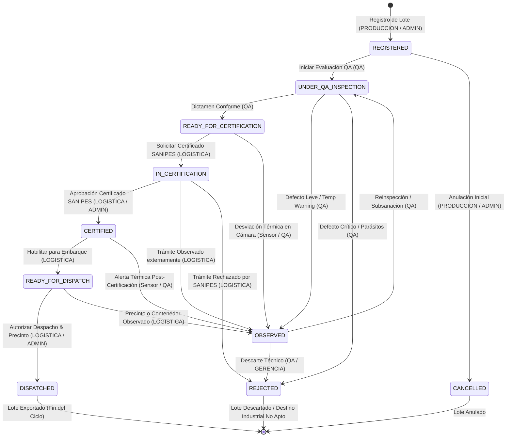

# Máquina de Estados Oficial y Reglas de Transición del Lote — ExporTrace

**Versión:** 1.0  
**Fecha:** 2026-10-07  
**Estado:** PROPUESTA OFICIAL PRE-PRODUCCIÓN (PENDIENTE DE APROBACIÓN)

---

## 1. Diagnóstico de Inconsistencias Actuales

Actualmente existen discrepancias en la nomenclatura y semántica de los estados del lote entre distintas capas del sistema:

| Ubicación | Valores Actuales Utilizados | Problema Detectado |
|---|---|---|
| **Base de Datos (`exportrace.db`)** | `REGISTRADO`, `EN_PROCESO`, `APROBADO`, `EN CERTIFICACION`, `DESPACHADO` | Mezcla de español, strings con espacios y falta de estados intermedios. |
| **Backend Java (`Lot.java`, Servicios)** | `REGISTERED`, `IN_PROCESS`, `READY_FOR_CERTIFICATION`, `OBSERVED`, `IN_CERTIFICATION`, `CERTIFIED`, `READY_FOR_DISPATCH`, `DISPATCHED` | Código en inglés sin `Enum` fuertemente tipado en JPA. |
| **Frontend (`types/lot.ts`, Vistas)** | `REGISTRADO`, `EN_PROCESO`, `APROBADO`, `EN_TRANSITO`, `DESPACHADO`, `OBSERVADO` | Badges no mapean 1:1 con las respuestas del backend. |
| **Documentación Previa** | `CREADO`, `INSPECCIÓN QA`, `APROBADO_QA`, `CERTIFICADO`, `DESPACHADO` | Divergencia terminológica con el código fuente. |

---

## 2. Catálogo Oficial del Enum Canónico `LotStatus`

Se define un conjunto único de **10 estados canónicos** inmutables que rigen de extremo a extremo (Backend Java, BD SQLite y Frontend React):

```java
public enum LotStatus {
    REGISTERED,                 // Lote creado por Producción, pendiente de inspección QA
    UNDER_QA_INSPECTION,        // En evaluación física/organoléptica en planta
    OBSERVED,                   // Observado en QA o por desviación térmica (requiere subsanación)
    REJECTED,                   // No conforme definitivo (bloqueo total / descarte)
    READY_FOR_CERTIFICATION,    // QA Conforme y cadena de frío estable, apto para trámite SANIPES
    IN_CERTIFICATION,           // Expediente en trámite activo ante entidad sanitaria (SANIPES/SENASA)
    CERTIFIED,                  // Certificado Sanitario Oficial emitido y vigente
    READY_FOR_DISPATCH,         // Habilitado para asignación de contenedor, precinto y DUA
    DISPATCHED,                 // Contenedor precintado, DUA aprobada y despacho completado
    CANCELLED                   // Lote anulado administrativamente (baja lógica)
}
```

---

## 3. Diagrama de la Máquina de Estados Oficial



---

## 4. Matriz Exhaustiva de Reglas de Transición

### Transición T-01: Creación de Lote
* **Origen:** `[*]` (Nuevo registro)
* **Destino:** `REGISTERED`
* **Rol Autorizado:** `PRODUCCION`, `ADMINISTRADOR`, `SUPERADMIN`
* **Precondiciones:**
  1. Producto seleccionado existe y está activo en el catálogo.
  2. Peso neto > 0 y ≤ capacidad máxima de lote (ej. 50,000 kg).
  3. Planta de procesamiento válida.
  4. Código de lote único (`EXP-2026-XXX`).
* **Bloqueos:** No se puede despachar ni certificar en este estado.
* **Auditoría:** `LOT_CREATED` (guarda snapshot inicial completo).
* **Notificación:** `INFO` dirigida al rol `QA` ("Nuevo lote registrado para inspección").
* **Subsanación:** Si hubo error tipográfico, se permite edición controlada antes de QA (`BR-P1-004`).

---

### Transición T-02: Inicio y Evaluación de Calidad (QA)
* **Origen:** `REGISTERED` o `OBSERVED`
* **Destino:** `READY_FOR_CERTIFICATION`
* **Rol Autorizado:** `QA`, `SUPERADMIN`
* **Precondiciones:**
  1. Todos los parámetros organolépticos evaluados (apariencia, color, textura, olor, examen parasitológico).
  2. Dictamen final registrado como `CONFORME`.
  3. Al menos 1 evidencia fotográfica válida adjuntada.
  4. Registros de cadena de frío del lote dentro del rango normativo del producto (≤ -18°C para congelados).
* **Bloqueos:** Si el inspector es de Producción o Logística, la API deniega con HTTP 403.
* **Auditoría:** `QA_INSPECTION_COMPLETED` (dictamen, puntuación y fotos).
* **Notificación:** `SUCCESS` dirigida a `LOGISTICA` y `PRODUCCION` ("Lote aprobado por QA").
* **Subsanación:** N/A.

---

### Transición T-03: Observación de Calidad o Cadena de Frío
* **Origen:** `REGISTERED`, `UNDER_QA_INSPECTION`, `READY_FOR_CERTIFICATION`, `CERTIFIED`
* **Destino:** `OBSERVED`
* **Rol Autorizado:** `QA`, `SUPERADMIN`, Sistema Automático (Alerta Térmica)
* **Precondiciones:**
  1. Defecto organoléptico subsanable detectado O
  2. Sensor de temperatura registra fluctuación crítica (> -15°C en congelados).
* **Bloqueos:** **BLOQUEO TOTAL de Certificación y Despacho.**
* **Auditoría:** `LOT_OBSERVED` (motivo de observación y responsable).
* **Notificación:** `URGENT` a `PRODUCCION` y `GERENCIA` ("Lote observado, requiere calibración o reinspección").
* **Subsanación:** Se permite reinspección técnica 1:N registrando la causa y acción correctiva.

---

### Transición T-04: Solicitud de Certificación Sanitaria
* **Origen:** `READY_FOR_CERTIFICATION`
* **Destino:** `IN_CERTIFICATION`
* **Rol Autorizado:** `LOGISTICA`, `ADMINISTRADOR`, `SUPERADMIN`
* **Precondiciones:**
  1. Lote en estado `READY_FOR_CERTIFICATION` (**Bloqueante P0**).
  2. Expediente cuenta con Declaración Jurada de Origen y Registro de Producción.
  3. Cadena de frío conforme en las últimas 24 horas.
* **Bloqueos:** Prohibido solicitar si el lote está `OBSERVED`, `REJECTED` o `REGISTERED`.
* **Auditoría:** `CERTIFICATION_REQUESTED` (número de expediente y fecha).
* **Notificación:** `INFO` a `GERENCIA` ("Trámite SANIPES iniciado").
* **Subsanación:** Si el expediente carece de documentos, el sistema lo mantiene en `READY_FOR_CERTIFICATION` e indica faltantes.

---

### Transición T-05: Aprobación de Certificado Sanitario SANIPES
* **Origen:** `IN_CERTIFICATION`
* **Destino:** `CERTIFIED`
* **Rol Autorizado:** `LOGISTICA`, `ADMINISTRADOR`, `SUPERADMIN`
* **Precondiciones:**
  1. Trámite previo en estado `IN_CERTIFICATION`.
  2. Número de Certificado Oficial ingresado (formato SANIPES / SENASA).
  3. Archivo PDF del certificado adjunto con hash de integridad.
* **Bloqueos:** Prohibido aprobar sin número de certificado ni documento.
* **Auditoría:** `CERTIFICATION_APPROVED` (número de certificado, vigencia y PDF hash).
* **Notificación:** `SUCCESS` a `LOGISTICA` y `PRODUCCION` ("Certificado Sanitario Aprobado").
* **Subsanación:** En caso de anulación externa de SANIPES, se transiciona a `OBSERVED`.

---

### Transición T-06: Habilitación para Despacho
* **Origen:** `CERTIFIED`
* **Destino:** `READY_FOR_DISPATCH`
* **Rol Autorizado:** `LOGISTICA`, `SUPERADMIN`
* **Precondiciones:**
  1. Lote en estado `CERTIFIED`.
  2. Certificado no vencido.
* **Bloqueos:** No se puede autorizar salida sin contenedor asignado.
* **Auditoría:** `LOT_READY_FOR_DISPATCH`.
* **Notificación:** `INFO` a operaciones portuarias.
* **Subsanación:** N/A.

---

### Transición T-07: Autorización Final de Despacho
* **Origen:** `READY_FOR_DISPATCH`
* **Destino:** `DISPATCHED`
* **Rol Autorizado:** `LOGISTICA`, `ADMINISTRADOR`, `SUPERADMIN`
* **Precondiciones:**
  1. Número de contenedor marítimo / reefer válido (formato ISO 6346, ej. `SUDU-7894210`).
  2. Precinto oficial de seguridad registrado (ej. `SANIPES-SEAL-88412`).
  3. DUA / Declaración Aduanera ingresada.
  4. Temperatura del contenedor reefer conforme (≤ -18°C).
  5. Checklist de pre-embarque 100% completado.
* **Bloqueos:** **Estado terminal.** Un lote en `DISPATCHED` no puede ser editado, certificado nuevamente ni devuelto a producción.
* **Auditoría:** `DISPATCH_AUTHORIZED` (contenedor, precinto, transportista, DUA y puerto de destino).
* **Notificación:** `SUCCESS` a `GERENCIA` y todos los roles ("Lote despachado exitosamente para exportación").
* **Subsanación:** En caso de cancelación de embarque en puerto, requiere intervención de `SUPERADMIN` con evento de auditoría `DISPATCH_CANCELLED`.

---

### Transición T-08: Anulación Administrativa de Lote
* **Origen:** `REGISTERED`
* **Destino:** `CANCELLED`
* **Rol Autorizado:** `PRODUCCION`, `ADMINISTRADOR`, `SUPERADMIN`
* **Precondiciones:**
  1. Lote no ha sido evaluado en QA ni certificado.
  2. Motivo de anulación obligatorio (mínimo 15 caracteres).
* **Bloqueos:** Lote cancelado no es editable ni seleccionable.
* **Auditoría:** `LOT_CANCELLED` (motivo y usuario).
* **Notificación:** `WARNING` a Administradores.
* **Subsanación:** N/A (baja lógica definitiva).

---

## 5. Decisiones Normativas Aprobadas de Negocio

### Decisión 1: Política de Re-inspecciones QA
* **Regla:** Un lote puede tener **1 inspección inicial** y un **máximo de 2 re-inspecciones posteriores**.
* **Inmutabilidad:** Todas las inspecciones se conservan en historial 1:N; nunca se sobrescribe una inspección anterior.
* **Atributos:** Cada inspección registra secuencia/número, inspector, fecha/hora, motivo, resultado, observaciones y evidencias fotográficas.
* **Límite:** Si tras 2 re-inspecciones el lote sigue sin cumplir, transiciona de forma obligatoria a `REJECTED` o queda sujeto a procedimiento de reproceso debidamente auditado. El parámetro es centralizado/configurable.

### Decisión 2: Modelo de Despacho Logístico
* **Regla:** Alcance actual: **1 LOTE = 1 DESPACHO** (relación 1:1 en `dispatches.lote_id`).
* **Alcance:** El soporte de despachos parciales o múltiples por lote se documenta como una evolución futura de la arquitectura.

### Decisión 3: Almacenamiento Persistente de Evidencias Fotográficas
* **Arquitectura Oficial (Versión Actual):**
  1. **Archivos Físicos:** Almacenados en volumen de disco persistente en Render (*Persistent Disk* montado en `/app/data/uploads`, parametrizable mediante variable de entorno `FILE_UPLOAD_DIR`).
  2. **Metadatos en BD:** Entidad `QaEvidence` con `evidenceId`, `inspectionId`, `lotId`, `nombre`, `mimeType`, `sizeBytes`, `sha256Hash`, `storagePath`, `usuario`, `fechaHora`.
  3. **Seguridad y Acceso:** Descarga y visualización protegida a través de endpoints seguros del backend (sin exposición pública irrestricta de rutas de archivos).
* **Evolución Futura (No aplicable a v1.0):** Almacenamiento en AWS S3 o Cloudinary queda catalogado exclusivamente para fases posteriores de escalamiento horizontal.

### Decisión 4: Política de Concurrencia de Sesiones
* **Regla:** Máximo **UNA (1) sesión activa por usuario**.
* **Comportamiento:** Nuevo inicio de sesión revoca automáticamente la sesión anterior en BD (`UserSession.status = 'REVOKED'`) y emite evento de auditoría `CONCURRENT_LOGIN_REVOCATION`.
* **SuperAdmin:** Mantiene capacidad de visualización y revocación forzada en tiempo real; se conservan las políticas de timeout (idle / absolute) por rol.

### Decisión 5: Ciclo de Vida y Resolución de Alertas Térmicas
* **Regla:** Una alerta crítica **NO se elimina** automáticamente cuando la temperatura retorna al rango normal.
* **Estados de Incidencia:** `ACTIVE` $\rightarrow$ `UNDER_REVIEW` $\rightarrow$ `RESOLVED`.
* **Tratamiento:** Desviación crítica bloquea el avance del lote, genera registro de incidencia inmutable, conserva lecturas originales y notifica a responsables (`RF-31`).
* **Resolución:** Exige cierre técnico formal por parte del rol `QA` con responsable, motivo, justificación técnica y fecha/hora. Logística no puede levantar la alerta unilateralmente.

### Decisión 6: Desviación Térmica Post-Certificación Sanitaria (`BR-P1-013`)
* **Contexto:** `BR-P0-006` permanece como **IMPLEMENTADA Y VALIDADA** (bloqueo de despacho sin certificado emitido). La casuística de desviación ocurrida tras la emisión del certificado se gestiona mediante la nueva brecha **`BR-P1-013`**.
* **Regla:** Ante una fluctuación térmica crítica posterior a la emisión del certificado SANIPES y antes del despacho, **NO se revoca unilateralmente el certificado sanitario oficial externo**.
* **Acciones ExporTrace:**
  1. Bloquea preventivamente el estado `READY_FOR_DISPATCH` impidiendo la salida del lote.
  2. Genera incidencia crítica de inocuidad en el expediente del lote.
  3. Marca temporalmente el lote como *No Apto para Despacho*.
  4. Exige dictamen técnico de re-evaluación por el área de Calidad (QA).
  5. Conserva intactos el certificado sanitario y la bitácora histórica previa.
  6. Requiere resolución técnica documentada (`RESOLVED`) antes de rehabilitar el lote para despacho.

---

## 6. Fuente Canónica de Documentación

> [!IMPORTANT]
> El directorio **`/docs`** en la raíz lógica del proyecto es la **FUENTE OFICIAL Y CANÓNICA** de las especificaciones y reglas de negocio. Todas las réplicas en `/exportrace-ica-backend/docs` y `/exportrace-ica-frontend/docs` son espejos sincronizados.

