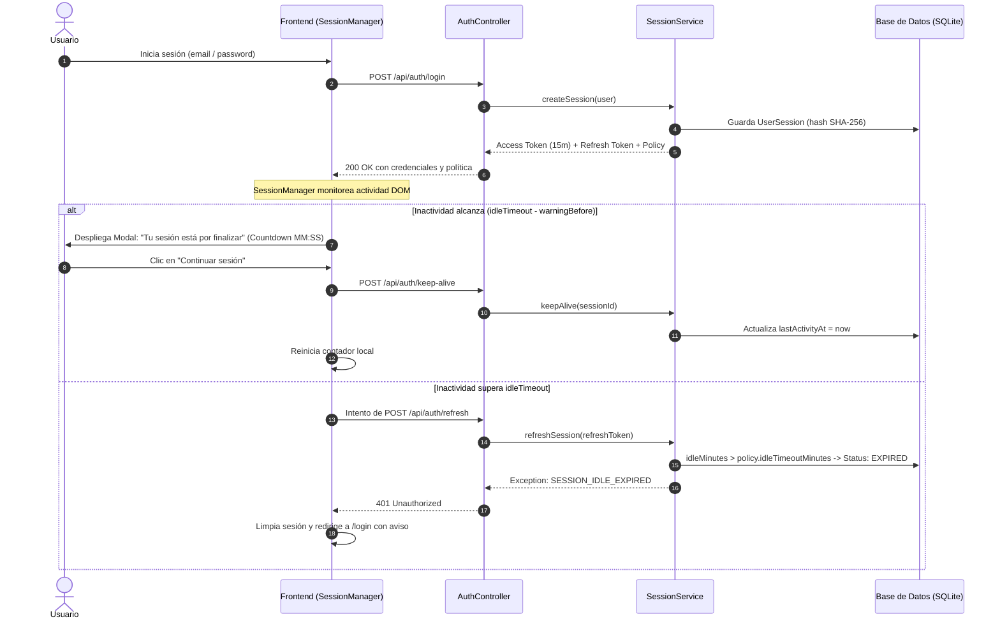

# ExporTrace — Política de Seguridad, Sesiones y Ciclo de Vida JWT

Este documento detalla la arquitectura de seguridad, la gestión del ciclo de vida de sesiones de usuario, el mecanismo de refresh token y las políticas dinámicas por rol implementadas en **ExporTrace**.

---

## 1. Requerimientos de Seguridad Asociados

* **RF-24: Gestión de Sesiones de Usuario:** El sistema administra de forma centralizada y persistente cada sesión mediante la entidad `UserSession`, aplicando tiempos de inactividad (*idle timeout*) y límites de duración máxima absoluta (*absolute timeout*) por rol.
* **RF-25: Revocación de Sesiones:** Permite revocar sesiones de usuario de forma inmediata ante eventos de cierre de sesión (*logout*), desactivación de cuenta, restablecimiento de contraseña, modificación de privilegios/roles o acción manual directa del `SUPERADMIN`.
* **RNF-09: Expiración Segura de Sesión:** El backend actúa como autoridad única para validar la vigencia de la sesión y del token. Si un usuario excede su límite de inactividad o duración absoluta, cualquier intento de refresco o consulta protegida es rechazado con código HTTP 401 (`SESSION_IDLE_EXPIRED` o `SESSION_ABSOLUTE_EXPIRED`).
* **RNF-10: Protección de Tokens:** Los access tokens JWT tienen una vigencia reducida (15 minutos). Los refresh tokens opacos se almacenan en base de datos únicamente en formato hash SHA-256 (`refreshTokenHash`), impidiendo la fuga de credenciales o exposición en logs y auditorías.

---

## 2. Matriz de Políticas de Sesión por Rol

Las políticas de sesión se almacenan en la tabla `session_policies` y pueden ser modificadas en tiempo de ejecución por el `SUPERADMIN` desde `/superadmin/security`:

| Rol | Inactividad Máxima (*Idle Timeout*) | Duración Absoluta Máxima (*Absolute Timeout*) | Aviso Previo (*Warning*) | Estado Predeterminado |
|---|:---:|:---:|:---:|:---:|
| **SUPERADMIN** | **15 minutos** | **2 horas (120 min)** | **2 minutos antes** | Activa |
| **ADMINISTRADOR** | **20 minutos** | **4 horas (240 min)** | **2 minutos antes** | Activa |
| **QA** | **30 minutos** | **6 horas (360 min)** | **2 minutos antes** | Activa |
| **PRODUCCION** | **60 minutos** | **8 horas (480 min)** | **5 minutos antes** | Activa |
| **LOGISTICA** | **45 minutos** | **8 horas (480 min)** | **5 minutos antes** | Activa |
| **GERENCIA** | **30 minutos** | **4 horas (240 min)** | **2 minutos antes** | Activa |

---

## 3. Arquitectura del Ciclo de Vida de Sesión

---

## 4. Endpoints de Gestión de Seguridad y Sesiones

### Públicos / Autenticación (`/api/auth`)
* `POST /api/auth/login`: Autentica credenciales y emite access token (15 min) + refresh token + política de rol.
* `POST /api/auth/refresh`: Valida refresh token y sesión activa, regenerando el access token.
* `POST /api/auth/keep-alive`: Extiende la última actividad de la sesión activa (`lastActivityAt`).
* `POST /api/auth/logout`: Revoca el refresh token y marca la sesión como `REVOKED`.

### SuperAdmin (`/api/superadmin/security`)
* `GET /api/superadmin/security/session-policies`: Obtiene todas las políticas configuradas por rol.
* `GET /api/superadmin/security/session-policies/{role}`: Obtiene la política específica de un rol.
* `PUT /api/superadmin/security/session-policies/{role}`: Modifica la política dinámica con validaciones y registra el evento `SESSION_POLICY_UPDATED`.
* `GET /api/superadmin/security/sessions`: Lista todas las sesiones activas, expiradas y revocadas sin exponer tokens.
* `POST /api/superadmin/security/sessions/{sessionId}/revoke`: Revoca inmediatamente una sesión específica.

---

## 5. Eventos de Auditoría de Sesión

* `LOGIN_SUCCESS`: Inicio de sesión exitoso con ID de sesión asignado.
* `LOGIN_FAILED`: Intento fallido con contraseña incorrecta o usuario no existente.
* `TOKEN_REFRESH`: Renovación exitosa del token JWT de acceso.
* `SESSION_EXPIRED`: Sesión finalizada por inactividad o límite de duración absoluta.
* `SESSION_REVOKED`: Sesión revocada por cambio de rol, desactivación de cuenta, password reset o acción administrativa.
* `LOGOUT`: Cierre de sesión voluntario del usuario.
* `SESSION_POLICY_UPDATED`: Modificación de política de sesión por rol con registro de valores anteriores y nuevos.
